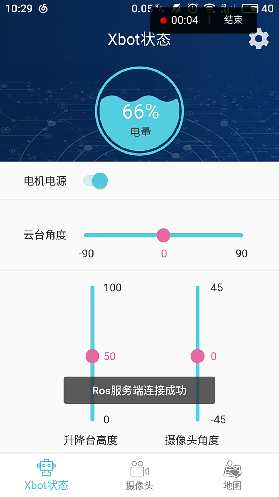
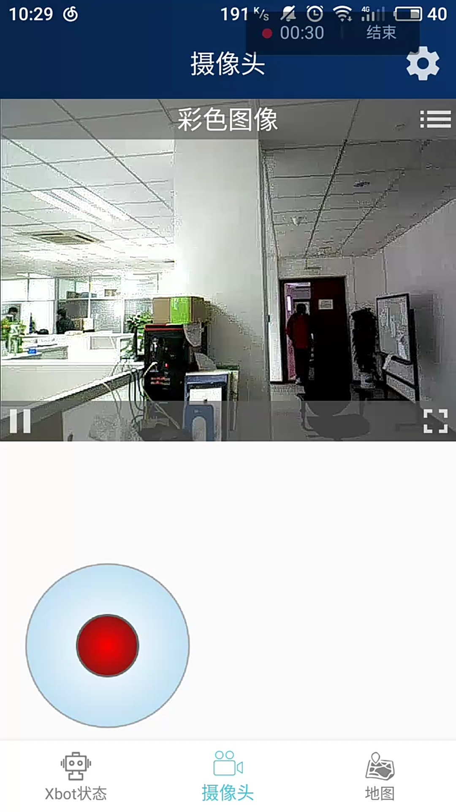
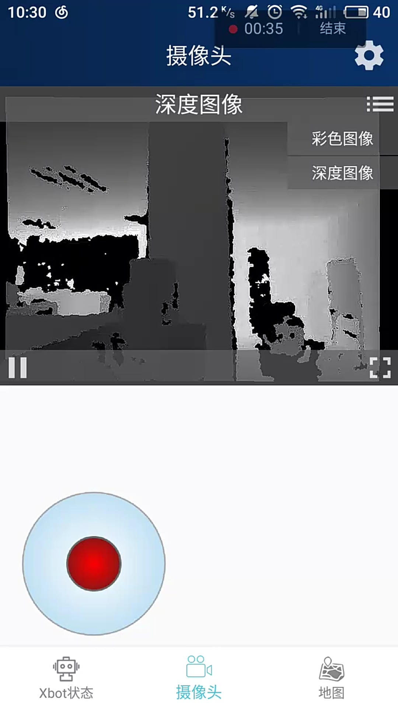

# Xbot Player   

XbotPlayer is an Android application which can control the movement of  [Xbot Robot](http://robots.ros.org/xbot/)  and displays 2D map of real time scene.

Download Link : https://fir.im/vuez

## ScreeenShot:

When there is no connection to ROS server :

When the  ROS server is connected,we can use rocker  at the bottom to control the movement of Xbot Robot :

The 2D map in part of  our office.

The camera function of Xbot Player is in development stage.
